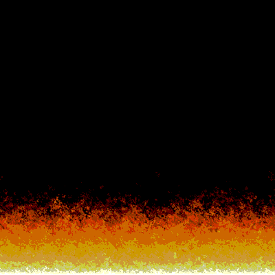

# DOOM FIRE!

**Made with <3 by [mateus.digital](https://mateus.digital).**


<p align="center">
    
</p>

## Description:

DOOM FIRE! is a creative experience inspired by the [amazing blog](https://fabiensanglard.net/doom_fire_psx/index.html) post of [Fabian Sanglard](https://fabiensanglard.net/about/index.html).


You can [check it online](https://mateus.digital/doom_fire).

<br>

As usual, you are **very welcomed** to **share** and **hack** it.


## Building


```bash
git clone https://github.com/mateusdigital/doom_fire
cd doom_fire
./scripts/build-static.sh      ## Builds the webpage for the project.
```


## Thanks to:

- [Fabian Sanglard](https://fabiensanglard.net/about/index.html).


## License:

This software is released under [GPLv3](https://www.gnu.org/licenses/gpl-3.0.en.html).


## Others:

- Email: hello@mateus.digital
- Website: https://mateus.digital
- Itch.io: https://mateusdigital.itch.io
- Linkedin: https://www.linkedin.com/in/mateusdigital
- Twitter: https://www.twitter.com/_mateusdigital
- Youtube: https://www.youtube.com/@_mateusdigital

There's more FLOSS things at [mateus.digital](https://mateus.digital) :)
